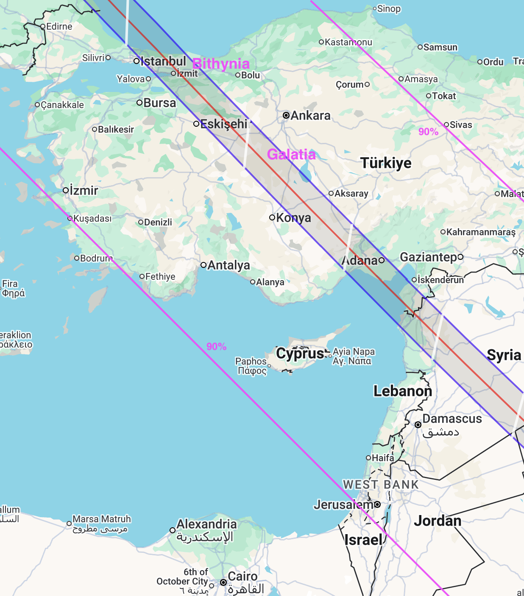
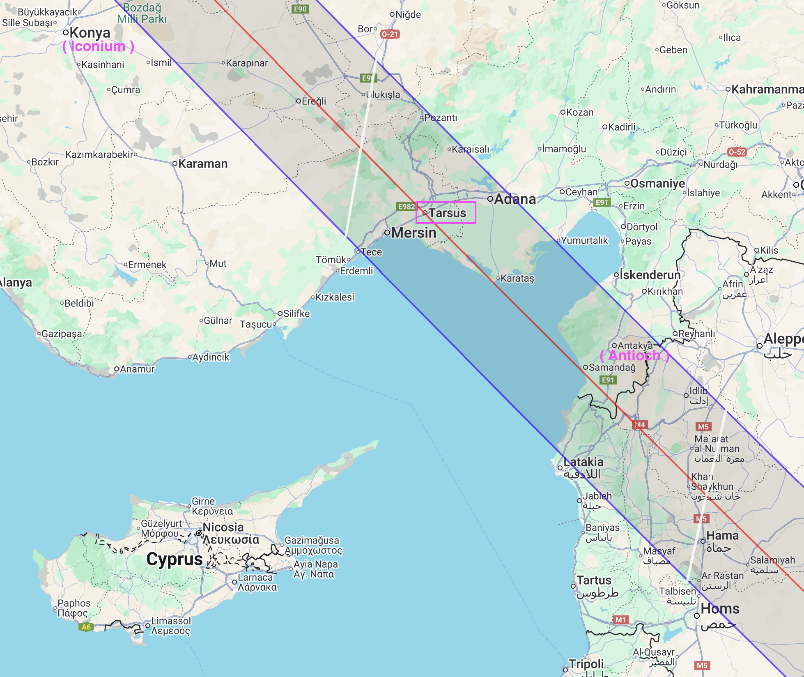

On 24 November 29AD a solar eclipse would have caused noticeable dimming across Judea, Syria, Arabia, Cyprus, Anatolia.

Africanus claimed Thallus attributed the crucifixion darkness to this eclipse.

> On the whole world there pressed a most fearful darkness; 
and the rocks were rent by an earthquake, and many places in Judea and other districts were thrown down. 
__This darkness Thallus, in the third book of his History, calls, as appears to me without reason, an eclipse of the sun__. 
For the Hebrews celebrate the passover on the 14th day according to the moon, and the passion of our Saviour falls on the day before the passover; 
but an eclipse of the sun takes place only when the moon comes under the sun. And it cannot happen at any other time but in the interval between the first day of the new moon and the last of the old, that is, at their junction: 
how then should an eclipse be supposed to happen when the moon is almost diametrically opposite the sun?  
-- Julius Africanus (quoted by Syncellus)

What if Thallus was correct?

Interactive eclipse map: <https://eclipsewise.com/solar/SEgmapx/0001-0100/SE0029Nov24Tgmapx.html>  
Eclipse Predictions by Fred Espenak, EclipseWise.com

----

Thallus writings have not survived, so we don't know he actually mentioned Jesus crucifixion. 
We don't even know when he wrote but there is some conjecture that Josephus referred to him, placing him at around 50AD. 

This would make them earlier than the gospels. 

<https://en.wikipedia.org/wiki/Thallus_(historian)>

See also William Craig on Thallus: <https://www.reasonablefaith.org/writings/question-answer/thallus-on-the-darkness-at-noon>

----

Africanus also claims Phlegon of Tralles records a three hour eclipse at full moon.

> __Phlegon records that, in the time of Tiberius Caesar, at full moon, there was a full eclipse of the sun from the sixth hour to the ninth — manifestly that one of which we speak.__ 
But what has an eclipse in common with an earthquake, the rending rocks, and the resurrection of the dead, and so great a perturbation throughout the universe? 
Surely no such event as this is recorded for a long period. 
But it was a darkness induced by God, because the Lord happened then to suffer. And calculation makes out that the period of 70 weeks, as noted in Daniel, is completed at this time.  
-- Julius Africanus

This would match the synoptic gospel account of the crucifixion darkness,
except that Eusebius provides a more detailed and potentially direct quote of Phlegon 
which merely implies the eclipse coincided with earthquakes in Bythinia.

> Indeed Phlegon, who is an excellent calculator of olympiads, 
also writes about this, in his 13th book writing thus:  
In the fourth year of the 202nd Olympiad, a great eclipse of the sun occurred at the sixth hour that excelled every other before it, 
turning the day into such darkness of night that the stars in the heavens were seen.
And there was an earthquake in Bithynia which overthrew many houses in the city of Nicaea.  
-- Phlegon of Tralles (quoted by Eusebius)

Phlegon's eclipse is certainly the one in 29AD. 
The significance of the earthquake is not that some houses fell down, 
but rather that it coincided with a spectacular eclipse.

----

Let's consider the explanatory power of assuming the date of Jesus crucifixion was near enough to the solar eclipse in November 29AD that some followers claimed it as divine acknowledgement. 

<https://www.youtube.com/watch?v=G10m2ZZRH4U>

----

First up, this solar eclipse becomes the most reasonable explanation for Galatians 3:1 
where Paul reminds the church - on or adjacent to the path of totality - that they were eyewitnesses to the crucifixion. 

> You foolish Galatians! Who has bewitched you? 
__It was before your eyes that Jesus Christ was publicly exhibited as crucified!__  
-- Galatians 3:1

This would also explain why Antioch - also on the path of totality - was such a stronghold of early christianity. 

> Now those who were scattered because of the persecution that arose over Stephen traveled as far as Phoenicia and Cyprus and Antioch, 
speaking the word to no one except Jews. 
But there were some of them, men of Cyprus and Cyrene, 
__who on coming to Antioch spoke to the Hellenists__ also, preaching the Lord Jesus. 
And the hand of the Lord was with them, __and a great number who believed turned to the Lord.__  
...  
__And in Antioch the disciples were first called Christians.__  
-- Acts 11:19-26

Similarly, Tarsus was on the path of totality. 
According to Acts, Paul was born in Tarsus, although not living there at the church's foundation. 
It is possible he had relatives who were there during the eclipse. 
Potentially this could explain Paul's statement in Romans 16 that he had kinsmen who were Christian before him. 

> Then Barnabas went to Tarsus to look for Saul, 
and when he found him, he brought him to Antioch. 
So for a whole year Barnabas and Saul met with the church and taught great numbers of people.  
-- Acts 11:25-26 

> Then Paul said: “I am a Jew, born in Tarsus of Cilicia, but brought up in this city. 
I studied under Gamaliel and was thoroughly trained in the law of our ancestors."  
-- Acts 22:2-3
 
> Greet Andronicus and Junia, my kinsmen and my fellow prisoners. 
They are well known to the apostles, and they were in Christ before me.  
-- Romans 16:7

----

Lastly, Peter's speech in Acts 2 can be taken literally.

> But Peter ... raised his voice and addressed them:  
'This is what was spoken through the prophet Joel:  
"In the last days it will be, God declares,  
that I will pour out my Spirit upon all flesh,  
and your sons and your daughters shall prophesy...  
And I will show portents in the heaven above.  
and signs on the earth below,  
blood, and fire, and smoky mist.  
__The sun shall be turned to darkness and the moon to blood__  
before the coming of the Lord’s great and glorious day.  
And it shall come to pass that everyone who calls upon the name of the Lord shall be saved.  
-- Acts 2:14-21

Intriguingly, just two weeks after the solar eclipse there was a lunar eclipse.  
<https://eclipsewise.com/lunar/LEprime/0001-0100/LE0029Dec09Pprime.html>

Being a partial lunar eclipse it would not be a classic blood moon unless accompanied by dust or smoke. 
But a knowledgeable person could have been able to point it out, 
especially to people who had seen the total lunar eclipse which occurred six months earlier.  
<https://eclipsewise.com/lunar/LEprime/0001-0100/LE0029Jun14Tprime.html>

  

----
 
The gospels consistently date the crucifixion at Passover. 
But what about in the pre-gospel era? 

Hebrews never uses Passover imagery, instead focusin on the Day of Atonement imagery and even Melchizadek.   

> Into the [Most Holy Place] the high priest goes, and he but once a year, and not without taking blood, which he offers for himself and for the unintentional sins of the people.  
...  
__But when Christ appeared as a high priest of the good things that have come__, 
then through the greater and more perfect tent (not made with hands, that is, not of this creation) 
__he entered once for all into the holy places__, 
not by means of the blood of goats and calves but by means of his own blood, 
thus securing an eternal redemption.  
-- Hebrews 9:7,11-12

> We have this as a sure and steadfast anchor of the soul, a hope that enters into the inner place behind the curtain, 
where Jesus has gone as a forerunner on our behalf, 
__having become a high priest forever after the order of Melchizedek__.
-- Hebrews 6:19-20 
 
Likewise Epistle of Barnabas explores several typologies for Christ and christian living but never Passover.   

> How, then, ran the commandment? Give your attention. 
__Take two goats of goodly aspect, and similar to each other, and offer them.__ 
And let the priest take one as a burnt-offering for sins. 
And what should they do with the other? Accursed, says He, is the one. 
__Mark how the type of Jesus now comes out.__ 
And all of you spit upon it, and pierce it, and encircle its head with scarlet wool, and thus let it be driven into the wilderness. 
...  
__Behold, then, the type of Jesus who was to suffer.__ 
But why is it that they place the wool in the midst of thorns? 
__It is a type of Jesus set before the view of the Church,__  
that any one who wishes to bear it away may find it necessary to suffer much, 
because the thorn is formidable, and thus obtain it only as the result of suffering.    
-- Epistle of Barnabas, Chapter 7

> __Now what do you suppose this to be a type of, that a command was given to Israel, 
that men of the greatest wickedness should offer a heifer__ 
and slay and burn it, 
and, that then boys should take the ashes, and put these into vessels, 
and bind round a stick purple wool along with hyssop, 
and that thus the boys should sprinkle the people, one by one, 
in order that they might be purified from their sins? 
Consider how He speaks to you with simplicity. 
__The calf is Jesus: the sinful men offering it are those who led Him to the slaughter.__ 
But now the men are no longer guilty, are no longer regarded as sinners.  
-- Epistle of Barnabas, Chapter 8

----

Paul does call Jesus our Passover Lamb, but that is in the context of Corinthians already observing the Festival of Unleavened Bread. 

> Your boasting is not good. Do you not know that a little leaven leavens the whole lump? 
Cleanse out the old leaven that you may be a new lump, as you really are unleavened. 
For Christ, our Passover lamb, has been sacrificed. 
__Let us therefore celebrate the festival, 
not with the old leaven, the leaven of malice and evil, 
but with the unleavened bread of sincerity and truth.__  
-- 1 Corinthians 5:6-8 

He also explores other imagery and typology, including Day of Atonement, 
Christ as the New Adam, the Spirit as a New Covenant, baptism as dying with Christ. 
After all, for Paul, all Jewish rituals are a foreshadowing of Christ. 

> __Since all have sinned__ and fall short of the glory of God; they are now justified by his grace as a gift, 
through __the redemption that is in Christ Jesus, whom God put forward as a sacrifice of atonement by his blood__.  
-- Romans 3:23-25

> Therefore let no one pass judgment on you in questions of food and drink, or with regard to a festival or a new moon or a Sabbath. 
These are a shadow of the things to come, but the substance belongs to Christ.
-- Colossians 2:16-17

Even the gospels acknowledge that for Jesus to be arrested and executed in Jerusalem at one of the major pilgrimage festivals 
goes against the grain of the stability the Jewish leaders and Roman administration would be hoping for.

>  Now the Passover and the Festival of Unleavened Bread were only two days away, 
and the chief priests and the teachers of the law were scheming to arrest Jesus secretly and kill him. 
__“But not during the festival,” they said, “or the people may riot.”__   
-- Mark 14:1-2

----

Assuming that Jesus was in fact crucified around of the solar eclipse seems to have significant explanatory power. 

But what about contradictory data - foremost being that all the gospel authors accepted a Passover crucifixion? 

And if the gospels are wrong about the timing, presumably the Passion week narrative is a later tradition too. 
If that is the case, how might the Passion week narrative have evolved? 

----

The NT epistles plus Barnabas and Clement explore different imagery and typology. 
But they all agree that Jesus death was a substitionary sacrifice. 
Already this makes Passover and Yom Kippur the most likely candidates for annual commemorations of Jesus death. 
Passover probably is the stronger candidate because:

- Day of Atonement is an ongoing substitionary sacrifice. The original Passover Lamb was a once off.
- Passover has a richer narrative with broad application. 
- Passover together with Shavuot commemorates the covenant of God with his people. 
- Passover was a pilgrimage festival which would fit with the gospel narrative of crowds being in Jerusalem when Jesus was crucified. 

And finally, there is these two "firstfruits" analogies of Paul:

> But in fact Christ has been raised from the dead, the firstfruits of those who have fallen asleep.  
-- 1 Corinthians 15:20

> And not only the creation, but we ourselves, who have the firstfruits of the Spirit, groan inwardly as we wait eagerly for adoption as sons, the redemption of our bodies.  
-- Romans 8:23

There are two Jewish firstfruits offerings:

- Barley, **the first Sunday after Passover**:  
  <https://tmurphywrites.com/feast-of-the-sheaf-of-first-fruits-jesus-as-the-sheaf/>

- Wheat, **at Pentecost**:  
  <https://tmurphywrites.com/pentecost-from-barley-to-wheat/>

----

If Jesus was executed in the lull between Sukkot and Hannukah, how could the Passion week tradition have begun? 

This isn't a novel question and the following may have already been proposed. 
Some scenes in the Passion narrative resonate with different Jewish rituals:

- The triumphal entry: Sukkot
- The cleansing of the temple: Hannukah
- Watching and praying on the Mount of Olives: Leil Shimurim
- Jesus or Barabbas: The two goats of Yom Kippur

And in fact, the gospel of John does record Jesus going to Jerusalem for Sukkot and other festivals (hardly a contentious issue). 

Initially Jewish christians (and Jewish-adjacent christians) would have been adapting the comemmorations for Jewish holy days. These might even turn into short plays. 

Eventually someone writes these all down for distribution - which is probably moderately successful. But when the author of Mark fuses a lot of different stories and teachings into a coherent narrative it has a viral moment and becomes the template for what a gospel must contain. 

----

**Contradictory data**

- Why aren't there more allusions to an eclipse in the NT letters?
- I would expect Peter to have been repeating it frequently, and yet neither of the letters attributed to Peter mention it.
- Gospel of John doesn't include the darkness.
- The Eucharist in 1 Corinthians 11 possiibly resonates with Passover more than other Jewish tradition. 
- Why doesn't Josephus give any hint of it? He seems fine to include signs and wonders. 
- Shouldn't it have been easier to convince followers of John the Baptist? 
- Mark seems to use the darkness as imagery for God abandoning Jesus. If the first christians took it as validation of Jesus, how did that evolve into the way Mark uses it?  
  OTOH the gospels do have the centurion seem to take the darkness as validation. 
- Why do the gospels say "No sign will be given"?

I wonder if most of these can be somewhat explained away by the fact that Jerusalem wasn't on the path of totality.  
Superstitious people who saw the total eclipse (in Antioch, Tarsus, Galatia) were convinced it was a sign, they were just waiting for someone to convince them what it was a sign of. 
For people off the path (like in Jerusalem), the eclipse was only confirmation if they were already inclined to believe.  

----

**Final thoughts**

The proposition that Jesus’s crucifixion aligned with a solar eclipse in November would invalidate the Passover chronology of the Synoptic Gospels. 
Yet this very idea assumes that the Gospels have captured a genuine early Christian memory - 
that is, the "darkness" over the whole land. 
This paradox was first pointed out by Origen in Contra Celsum

> But if Celsus believe the Gospel accounts when he thinks that he can find in them matter of charge against the Christians, and refuse to believe them when they establish the divinity of Jesus, our answer to him is:  
Sir, either disbelieve all the Gospel narratives, and then no longer imagine that you can found charges upon them; or, in yielding your belief to their statements, look in admiration on the Logos of God, who became incarnate, and who desired to confer benefits upon the whole human race. And this feature evinces the nobility of the work of Jesus, that, down to the present time, those whom God wills are healed by His name. And with regard to the eclipse in the time of Tiberius Cæsar, in whose reign Jesus appears to have been crucified, and the great earthquakes which then took place, Phlegon too, I think, has written in the thirteenth or fourteenth book of his Chronicles.  
-- Origen, Contra Celsum, Book 2, Chapter 33
