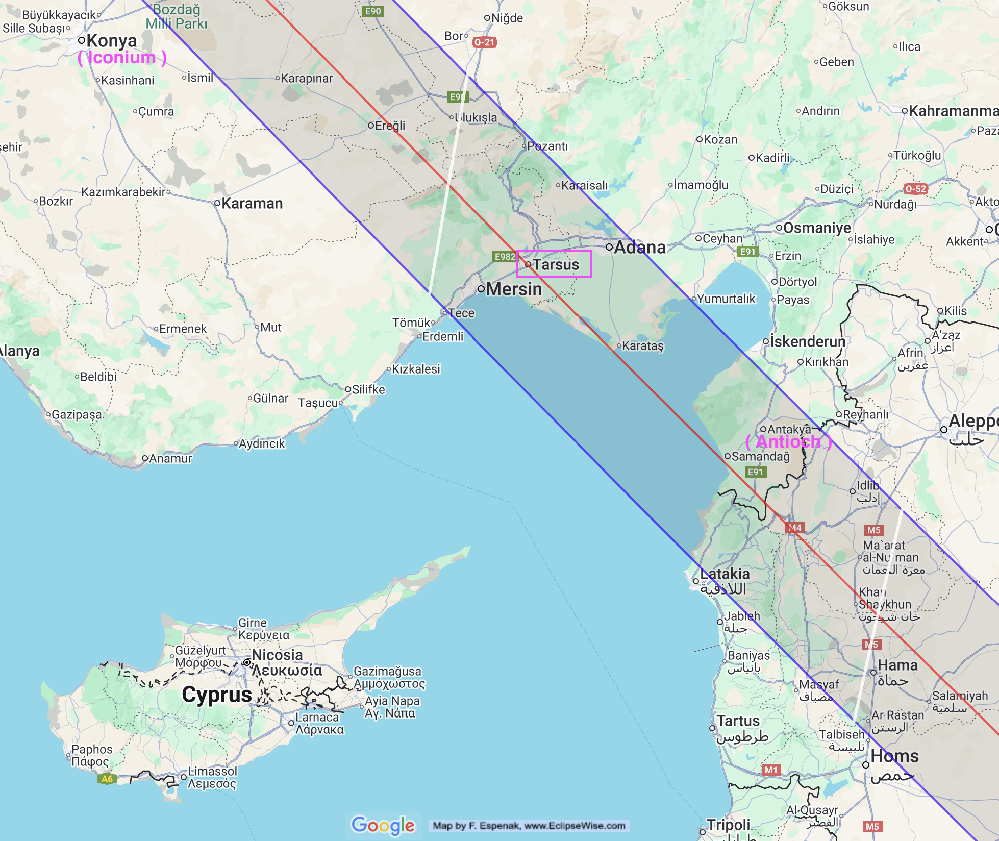

On 24 November 29AD a solar eclipse would have caused noticeable dimming across Judea, Syria, Arabia, Cyprus, Anatolia.

Africanus claimed Thallus attributed the crucifixion darkness to this eclipse.

What if Thallus was correct?

https://eclipsewise.com/solar/SEgmapx/0001-0100/SE0029Nov24Tgmapx.html  
Eclipse Predictions by Fred Espenak, EclipseWise.com

----

Thallus writings have not survived, so we don't know he actually mentioned Jesus crucifixion. We don't even know when he wrote but there is some conjecture that Josephus referred to him, placing him at around 50AD. 

THis would make them earlier than the gospels. 

<https://en.wikipedia.org/wiki/Thallus_(historian)>

See also William Craig on Thallus: <https://www.reasonablefaith.org/writings/question-answer/thallus-on-the-darkness-at-noon>

----

Africanus also claims that Phlegon of Tralles records a three hour eclipse at the full moon. This would match the synoptic gospel account of the crucifixion darkness, except that Eusebius provides a more detailed and potentially direct quote of Phlegon which merely implies the eclipse coincided with earthquakes in Bythinia. 

Phlegon's eclipse is certainly the one in 29AD. The significance of the earthquake is not that some houses fell down, but rather that it coincided with a spectacular eclipse. 

----

Let's explore the explanatory power of assuming the date of Jesus crucifixion was near enough to the solar eclipse in November 29AD that some followers claimed it as divine acknowledgement. 

----

First up, this solar eclipse becomes the most reasonable explanation for Galatians 3:1 where Paul reminds the Galatians - on or near the path of totality - that they were eyewitnesses to the crucifixion. 

This would explain why Antioch - also on the path of totality - was such a stronghold of early christianity. 

Similarly, Tarsus was on the path of totality. According to Acts, Paul was from Tarsus - it is possible he had relatives who were there during the eclipse. Potentially this could explain Paul's statement in Romans 16 that he had kinsmen who were in Christ before him. 

----

Lastly, Peter's speech in Acts 2 can be taken more literally. 

Intriguingly, just two weeks after the solar eclipse there was a lunar eclipse.  
<https://eclipsewise.com/lunar/LEprime/0001-0100/LE0029Dec09Pprime.html>

Being a partial lunar eclipse it would not be a classic blood moon unless it was accompanied by dust or smoke. But a knowledgeable person could have been able to point it out, especially to people who had seen the total lunar eclipse which occurred six months earlier.  

  

<https://eclipsewise.com/lunar/LEprime/0001-0100/LE0029Jun14Tprime.html>  

----

Are there any arguments against an early tradition of crucifixion at Passover? 

Why is Hebrews so focused on the Day of Atonement typology or even Melchizadek, but never Passover typology? 
Why is Epistle of Barnabas exploring several typologies for Christ and christian living but never Passover?

----

Paul does mention Passover, but he also explores several typologies, including Adam, New Covenant, Day of Atonement. He also says all Jewish rituals are a foreshadowing of Christ. 

For Jesus to be arrested and executed in Jerusalem at one of the major pilgrimage festivals - while plausible - goes against the grain of the stability the Jewish leaders and Roman administration would be hoping for.  Even the gospels has the Jewish leaders say "But not during the festival or the people may riot." 

----

Assuming that Jesus was not executed at Passover but was in fact crucified around of the solar eclipse seems to have significant explanatory power. 

But what about contradictory data - foremost being that all the gospel authors accepted a Passover crucifixion? 

And if the gospels are wrong about the timing, presumably the Passion week narrative is unreliable too. In that case, how might the Passion week narrative have evolved? 

----

The NT epistles plus Barnabas and Clement explore different typologies. But they all agree that Jesus death was a substitionary sacrifice. This probably makes Passover and Yom Kippur the most likely candidates for an annual memorial day for Jesus death. Passover probably is the stronger candidate because:

- Day of Atonement is an ongoing sacrifice. The original Passover Lamb was a one off. 
- Passover has a richer narrative with broad application. 
- Passover was a pilgrimage festival which would fit with the gospel narrative of crowds being in Jerusalem when Jesus was crucified. 

And finally, there is these two "firstfuits" analogies of Paul:

> But in fact Christ has been raised from the dead, the firstfruits of those who have fallen asleep.  
-- 1 Corinthians 15:20

> And not only the creation, but we ourselves, who have the firstfruits of the Spirit, groan inwardly as we wait eagerly for adoption as sons, the redemption of our bodies.  
-- Romans 8:23

There are two Jewish firstfruits offerings:

- Barley, **the first Sunday after Passover**:  
  <https://tmurphywrites.com/feast-of-the-sheaf-of-first-fruits-jesus-as-the-sheaf/>

- Wheat, **at Pentecost**:  
  <https://tmurphywrites.com/pentecost-from-barley-to-wheat/>

----

If Jesus was executed in the lull between Sukkot and Hannukah, how could the Passion week tradition have begun? 

This isn't a novel question and the following may have already been proposed. 
Some scenes in the Passion narrative resonate with different Jewish rituals:

- The triumphal entry: Sukkot
- The cleansing of the temple: Hannukah
- Watching and praying on the Mount of Olives: Leil Shimurim
- Jesus or Barabbas: The two goats of Yom Kippur

And in fact, the gospel of John does record Jesus going to Jerusalem for Sukkot and other festivals (hardly a contentious issue). 

Initially Jewish christians (and Jewish-adjacent christians) would have been adapting the comemmorations for Jewish holy days. These might even turn into short plays. 

Eventually someone writes these all down for distribution - which is probably moderately successful. But when the author of Mark fuses a lot of different stories and teachings into a coherent narrative it has a viral moment and becomes the template for what a gospel must contain. 

----

**Contradictory evidence**

- Why aren't there more allusions to an eclipse in the NT letters?
- I would expect Peter to have been repeating it frequently, and yet neither of the letters attributed to Peter mention it. 
- The Eucharist in 1 Corinthians 11 seems to resonate with Passover more than any other Jewish tradition. 
- Why doesn't Josephus give any hint of it? He seems fine to include signs and wonders. 
- Shouldn't it have been easier to convince followers of John the Baptist? 
- Mark seems to use the darkness as imagery for God abandoning Jesus. If the first christians took it as validation of Jesus, how did that evolve into the way Mark uses it?  
  OTOH the gospels do have the centurion seem to take the darkness as validation. 
- Why do the gospels say "No sign will be given"?

I wonder if most of these can be somewhat explained away by the fact that Jerusalem wasn't on the path of totality.  
Superstitious people who saw the total eclipse (in Antioch, Tarsus, Galatia) were convinced it was a sign, they were just waiting for someone to convince them what it was a sign of. 
For people off the path (like in Jerusalem), the eclipse was only confirmation if they were already inclined to believe.  

----

**Final thoughts**

The proposition that Jesus’s crucifixion aligned with a solar eclipse in November would invalidate the Passover chronology of the Synoptic Gospels. Yet this very idea assumes that the Gospels have captured a genuine early Christian memory - that is, the "darkness" over the whole land. This paradox was first pointed out by Origen in Contra Celsum

> But if Celsus believe the Gospel accounts when he thinks that he can find in them matter of charge against the Christians, and refuse to believe them when they establish the divinity of Jesus, our answer to him is:  
Sir, either disbelieve all the Gospel narratives, and then no longer imagine that you can found charges upon them; or, in yielding your belief to their statements, look in admiration on the Logos of God, who became incarnate, and who desired to confer benefits upon the whole human race. And this feature evinces the nobility of the work of Jesus, that, down to the present time, those whom God wills are healed by His name. And with regard to the eclipse in the time of Tiberius Cæsar, in whose reign Jesus appears to have been crucified, and the great earthquakes which then took place, Phlegon too, I think, has written in the thirteenth or fourteenth book of his Chronicles.  
-- Origen, Contra Celsum, Book 2, Chapter 33