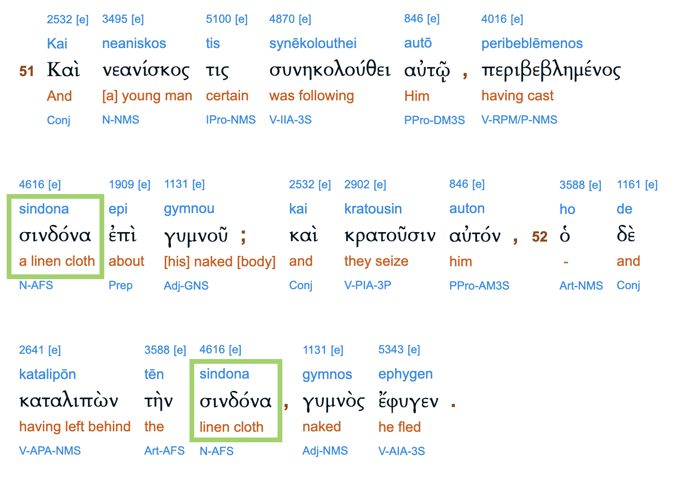
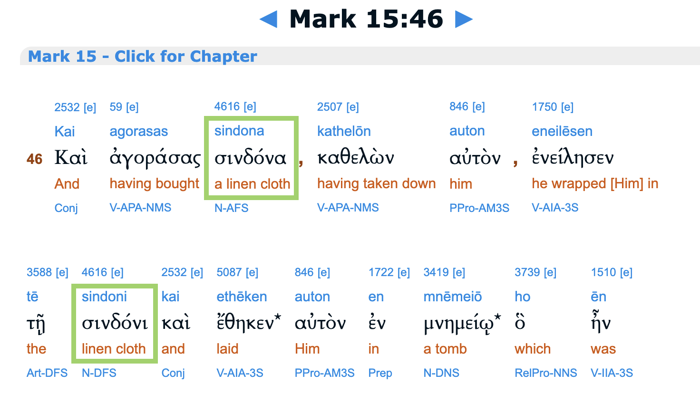

# Finding the original gospel according to Mark

In the gospel of Mark, are the young man who flees naked at Jesus arrest,
and the young man who is first to the empty tomb, the same individual?

----

There is the obvious similarity that they are both anonymous, young, men 
following Jesus around (alive or dead). 

> And immediately, while he was still speaking, Judas came, one of the twelve, and with him a crowd with swords and clubs, from the chief priests and the scribes and the elders. 
... 
And they laid hands on him and seized him.  
...  
And they all left him and fled.  
And _a young man_ followed him, with nothing but a linen cloth about his body. And they seized him, but he left the linen cloth and ran away naked.  
And _they led Jesus to the high priest_.  
-- Mark 14:43-53

> And entering the tomb, they saw _a young man_ sitting on the right side, dressed in a white robe, and they were alarmed. 
And he said to them, “Do not be alarmed. _You seek Jesus of Nazareth, who was crucified_. 
He has risen; he is not here. See the place where they laid him.  
-- Mark 16:5-6

----

The association is stronger when we notice the "linen cloth" of the young man in the garden 
is equivalent to the "linen shroud" used to wrap Jesus body -  
in Greek it is *σινδόνα* / *σινδόνι* (sindona / sindoni). 

What is the author trying to hint at?

----

If we visualize the empty tomb scene, 
surely it also contains a linen shroud, pointed to by that anonymous young man?

> And entering the tomb, they saw a young man sitting on the right side, dressed in a white robe, and they were alarmed.  
And he said to them,
“Do not be alarmed. You seek Jesus of Nazareth, who was crucified. He has risen; he is not here.  
_See the place where they laid him. **[The young man gestures at a linen cloth]**_  

----

It seems reasonable to suggest this was an implied stage direction when Mark was dramatized, 
and that this was plausibly the origin for John and Luke's gospels including burial clothes in the empty tomb. 

>  Both of them were running together, but the other disciple outran Peter and reached the tomb first. 
And stooping to look in, _he saw the linen cloths lying there_, but he did not go in. 
Then Simon Peter came, following him, and went into the tomb. _He saw the linen cloths lying there_.  
-- John 20:4-6

> But Peter rose and ran to the tomb; stooping and looking in, _he saw the linen cloths by themselves_; 
and he went home marveling at what had happened.  
-- Luke 24:12

----

Finally, it may be observed that the young man in Gethsemene enters the scene clothed and leaves naked,
while in the burial scene Jesus' body would be naked on the cross then clothed for entombment. 

> And they crucified him _and divided his garments among them_, casting lots for them, to decide what each should take.  
-- Mark 15:24

----

This foreshadowing is clear-cut when these vignettes are visualised and juxtaposed. 

> And immediately ... Judas came ... and with him a crowd with swords and clubs, from the chief priests and the scribes and the elders.  
...  
And they laid hands on him [Jesus] and seized him.  
And they [the disciples] all left him and fled.  
>  
> And _a young man_ followed him, _with nothing but a linen cloth about his body_. 
And they [the mob] seized him, but _he left the linen cloth and ran away naked_.  

> _And they crucified him [naked]_ and divided his garments among them, casting lots for them, to decide what each should take.

> And Joseph bought a linen shroud, 
and _taking him down [naked], wrapped him in the linen shroud_
and laid him in a tomb that had been cut out of the rock. 
And he rolled a stone against the entrance of the tomb.

> And entering the tomb, _they [the women] saw a young man sitting on the right side_, dressed in a white robe, and they were alarmed.  
And he said to them,
“Do not be alarmed. You seek Jesus of Nazareth, who was crucified. He has risen; he is not here.  
_See the place where they laid him. **[The young man gestures at a linen cloth]**_

----

But this foreshadowing had apparently been confusing for later audiences 
since none of the later gospels retain the incident of the young man fleeing the arrest scene.  

Later authors applied the principle of Chekhov's gun.

> If in the first act you have hung a pistol on the wall, then in the following one it should be fired. 
Otherwise don't put it there.

----

And yet it must be presumed Mark's initial audience recognized the link.  

One explanation for this in-group cognition is that Mark's audience 
**had already seen a dramatization where** 
the young man fleeing naked **actually occurs in the burial scene**.

What are the pros and cons of such a proposal? 

----

The young man's cameo in the arrest scene is:

1. inessential - the scene flows as well or better without his part.
2. irrational - why would the mob chase him instead of the disciples?
3. confusing - later gospel authors remove it, commentators look for symbolic meaning.

----

Conversely, if the young man's role was originally part of the burial scene, it would be:

1. an unambiguous connection with the empty tomb.
2. an essential role, if his linen cloth became Jesus burial garment.

----

Intriguingly there are possible vestiges of an earlier account of the burial story

- in a speech by Paul in Acts where **anonymous Jewish leaders** bury Jesus.
- in Mark's empty tomb scene where the young man says "see the place where **they** laid him".

Juxtaposing these snippets reveals a potential consistency.

> For those who live in Jerusalem and their rulers, 
because they did not recognize him nor understand the utterances of the prophets, which are read every Sabbath, 
fulfilled them by condemning him. 
And though they found in him no guilt worthy of death, _**they** asked Pilate to have him executed_. 
And when **they** had carried out all that was written of him, 
_**they** took him down from the tree and laid him in a tomb_.  
-- Acts 13:27-29

> And a young man followed him, with nothing but a linen cloth about his body. 
_And **they** seized him_, but he left the linen cloth and ran away naked.  
-- Mark 14:51-52

> And entering the tomb, they saw a young man sitting on the right side, dressed in a white robe, and they were alarmed.  
And he said to them, “Do not be alarmed. You seek Jesus of Nazareth, who was crucified. He has risen; he is not here. 
_See the place where **they** laid him_.  
-- Mark 16:5-6

----

The main argument against this proposal
(apart from no manuscript evidence)
is it almost necessitates a model of development for the gospel 
whereby the burial and empty tomb scenes are an evolving postscript 
while the rest of the gospel is stable. 

If the gospel originally ends before the burial 
then it significantly changes the **purpose** of the gospel.  

How would our current ending be accepted into such a gospel?

----

Now a gospel postscript is not an alien concept,
and some scholars are open to John 21 and Luke 1-2 being later additions.  

In fact there is an undisputed postscript in the longer ending of Mark, 
a similar scenario to this proposal, with the exceptions that:

- the longer ending seems to be obviously integrating already accepted details from other gospels.
- the longer ending did not erase the canonical ending from the manuscript record.
